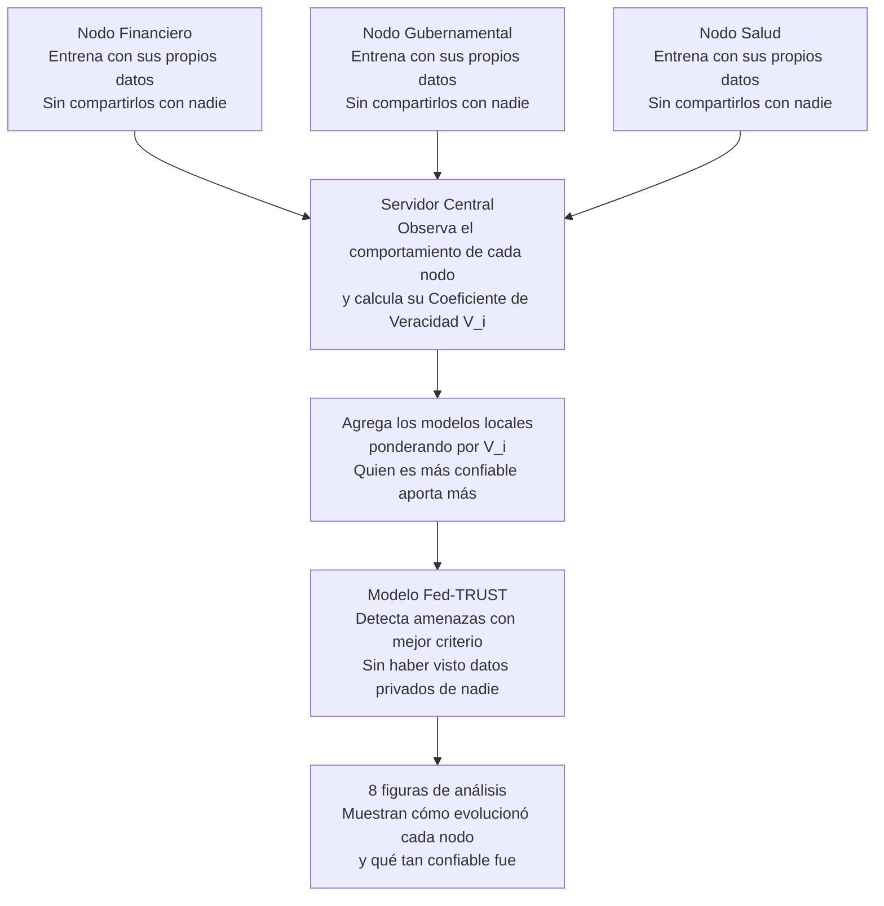

# EJD-UMA-001 v8.0: Fed-TRUST

**Ejercicio doctoral · Programa de Doctorado en Tecnologías Informáticas**
**Universidad de Málaga**

| Campo | Detalle |
|-------|---------|
| Autor | Ing. Edgar O. Herrera Logroño, M.Sc. |
| Directores propuestos | Prof. Ezequiel López Rubio · Prof. Juan Miguel Ortiz de Lazcano |
| Dataset | NSL-KDD (Network Security Lab, Dalhousie University) |
| Versión | 8.0 Fed-TRUST |
| Fecha | Abril 2026 |

---

## Objetivo

Este notebook es una extensión exploratoria del ejercicio EJD-UMA-001, que originalmente pedía comparar distintas configuraciones de Random Forest en un entorno federado usando el dataset NSL-KDD.

En las versiones anteriores el experimento funcionaba bien, pero quedaba una pregunta sin responder: ¿qué pasa si uno de los nodos que participa en el aprendizaje no está siendo honesto con lo que aporta?

En ciberseguridad institucional esa pregunta es muy concreta. Una entidad puede declarar que su postura de seguridad es buena, pero en la práctica tener controles débiles, responder lento ante incidentes, o incluso haber sido comprometida sin saberlo. Si esa entidad participa en un modelo compartido de detección de amenazas, sus aportes contaminan el resultado de todos.

Esta versión intenta dar un primer paso hacia ese problema, introduciendo un mecanismo que yo llamo Fed-TRUST.

---

## Que es Fed-TRUST

La idea central es simple: en lugar de que todos los nodos aporten igual al modelo global, cada nodo aporta en función de qué tan confiable parece ser su comportamiento.

Para medir esa confiabilidad, calculo un valor por nodo que llamo **Coeficiente de Veracidad**, o V_i. No es un valor que el nodo declara, sino que yo lo calculo cruzando cuatro señales distintas:

- Qué tan coherente es la distribución de datos del nodo (ICC, heredado de versiones anteriores)
- Qué tan dispersas son sus actualizaciones al modelo (Entropía)
- Qué tan rápido responde entre rondas de entrenamiento (Latencia Adversaria, L_a)
- Qué tan estables son sus parámetros de ronda en ronda (Jitter, J)

Un nodo con V_i alto es más confiable y pesa más en el modelo final. Uno con V_i bajo pesa menos, pero no se expulsa del sistema porque en entornos reales no siempre tienes certeza de que el nodo está comprometido.

---

## Como funciona paso a paso

---

## Control de cambios

| Versión | Fecha | Qué se agregó |
|---------|-------|---------------|
| v6.0 | Ene 2026 | Pipeline base con Random Forest federado y NSL-KDD |
| v7.0 | Feb 2026 | Variables de contexto CRISC: madurez (CMM), cobertura (KCI) y efectividad (FCI) de controles |
| v7.1 | Mar 2026 | Taxonomía de amenazas, dos figuras nuevas y preguntas abiertas de investigación |
| v8.0 | Abr 2026 | Fed-TRUST: Coeficiente de Veracidad V_i, variables que cambian por ronda, comparativa de tres modelos |

---

## Los tres modelos que compara este ejercicio

| Modelo | Qué hace | Versión |
|--------|----------|---------|
| Centralizado | Todos los datos van a un solo servidor. Es el techo teórico de rendimiento, pero inviable en la práctica porque viola la privacidad. | referencia |
| Federado Estándar | Cada nodo aporta igual. Sin importar si uno se comporta peor que los demás. | v7.1 |
| Fed-TRUST | Cada nodo aporta según su V_i. Quien tiene mejor comportamiento tiene más peso. | v8.0 |

---

## Variables nuevas en v8.0

Estas variables no existían en versiones anteriores. Se calculan en cada ronda de entrenamiento, por lo que pueden cambiar con el tiempo.

| Variable | Qué mide | Por qué importa en seguridad |
|----------|----------|------------------------------|
| V_i | Coeficiente de Veracidad del nodo. Va de 0 a 1. | Resume la confiabilidad del nodo en esa ronda. |
| L_a | Latencia Adversaria. Qué tan lento responde el nodo. | Una latencia que crece puede indicar interferencia silenciosa. |
| J | Jitter de Parámetros. Qué tanto varían sus pesos de ronda en ronda. | Una variación errática puede indicar manipulación. |
| N_RONDAS | Cuántas rondas de entrenamiento se ejecutan. Por defecto: 3. | Permite observar si el comportamiento del nodo cambia con el tiempo. |

---

## Cómo se calcula V_i

V_i combina cuatro componentes con pesos configurables:

| Componente | Qué representa | Peso |
|------------|----------------|------|
| ICC / ICC_max | Coherencia declarada del nodo | 40% |
| 1 menos H / H_max | Entropía inversa: menor dispersión es mejor | 30% |
| 1 menos L_a / L_a_max | Latencia adversaria inversa: menor latencia es mejor | 15% |
| 1 menos J / J_max | Jitter inverso: menor variación es mejor | 15% |

El resultado es un número entre 0 y 1. Cuanto más alto, más confiable parece el nodo en esa ronda.

---

## Resultados obtenidos

Los tres modelos se corrieron sobre NSL-KDD con 4,000 muestras balanceadas (2,000 normales y 2,000 ataques).

| Modelo | F1-Score |
|--------|----------|
| Centralizado | 0.9960 |
| Federado Estándar | 0.9930 |
| Fed-TRUST | 0.9920 |

Fed-TRUST obtuvo 0.0010 menos que el Federado Estándar. Eso es menos del 0.11% de diferencia, que no es estadísticamente significativo. Lo que sí vale la pena explicar es por qué no mejora: NSL-KDD es un dataset de laboratorio muy limpio, con patrones de ataque muy marcados. En esas condiciones, incluso el nodo simulado como comprometido aprende un modelo local razonable. El beneficio real de Fed-TRUST aparecería en escenarios con envenenamiento real y datos más ruidosos.

El nodo Gubernamental tuvo el V_i más bajo (0.1816) en las tres rondas, lo que redujo su peso a 14.66% en la agregación final. Salud tuvo el V_i más alto (0.6640) y aportó el 53.62% del peso. Eso es consistente con la simulación.

---

## Una limitación que vale mencionar

El V_i del nodo Gubernamental se mantuvo constante en las tres rondas (0.1816 siempre), aunque sus señales adversarias L_a y J crecieron. La razón es que la normalización usa el valor máximo de cada ronda, y ese máximo siempre es el propio Gubernamental. Entonces su contribución relativa de L_a y J queda siempre en cero, y el V_i no cae.

Esto no es un error en el código, pero sí es una limitación del diseño de la fórmula. Una normalización por umbral absoluto o histórico capturaría mejor esa degradación. Esa es una de las preguntas que quedan abiertas para profundizar.

---

## Las 8 figuras del notebook

| Figura | Qué muestra | Versión |
|--------|-------------|---------|
| 1 | Cómo se distribuyen los datos entre nodos (Dirichlet) | v6.0 |
| 2 | Qué tan distintos son los nodos entre sí (Jensen-Shannon) | v7.0 |
| 3 | Cómo cambiaron V_i, L_a, J y CMM en cada ronda de entrenamiento | v8.0 |
| 4 | Mapa de veracidad: dónde cae cada nodo según su ICC y su V_i | v8.0 |
| 5 | Comparativa de F1 entre los tres modelos | v8.0 |
| 6 | Coherencia declarada vs. entropía ejecutada, tamaño proporcional a V_i | v7.0 actualizada |
| 7 | Huella de cada nodo en cinco dimensiones (radar) | v7.0 actualizada |
| 8 | Cadena causal desde las señales adversarias hasta la pregunta abierta | v7.1 actualizada |

---

## Pregunta abierta que queda del ejercicio

Una vez que V_i existe como indicador por ronda, surge una pregunta que no tiene respuesta todavía: ¿es posible detectar que un nodo está empezando a degradarse antes de que eso afecte el rendimiento del modelo global, y sin centralizar los datos de nadie?

Eso queda como la siguiente linea natural de investigacion doctoral. Este ejercicio no resuelve esa pregunta, pero sí la formula de forma concreta y con datos reales.

---

## Cómo ejecutarlo

1. Abrir Google Colab (colab.research.google.com)
2. Ir a Archivo, Abrir cuaderno, GitHub, y pegar la URL de este repositorio
3. Ejecutar todo con Runtime, Run all
4. El notebook descarga NSL-KDD automáticamente. Si falla la descarga, genera un dataset sintético equivalente para que puedas igualmente ver los resultados
5. Todas las métricas y conclusiones se calculan con los valores reales de la ejecución, no hay nada fijo en el código

---

## Repositorios del proceso doctoral

| Código | Repositorio | Contenido |
|--------|-------------|-----------|
| EJD-UMA-001 | [RF_Federado_Ejercicio_Doctoral_UMA](https://github.com/eoherrera/RF_Federado_Ejercicio_Doctoral_UMA) | Random Forest Federado, comparativa de configuraciones |
| EJD-UMA-001 v8.0 | Este repositorio | Fed-TRUST: Coeficiente de Veracidad V_i y agregacion ponderada |
| EJD-UMA-002 | [TED_MDS_Ejercicio_Doctoral_UMA](https://github.com/eoherrera/TED_MDS_Ejercicio_Doctoral_UMA) | Tree Edit Distance y proyeccion MDS |
| EJD-UMA-003 | [EJD_UMA_003_NaiveBayes_Federado](https://github.com/eoherrera/EJD_UMA_003_NaiveBayes_Federado) | Clasificador Naive Bayes Federado con mezcla de distribuciones |

---

## Stack técnico

Python 3.10 o superior, scikit-learn 1.3 o superior, NumPy, Pandas, Matplotlib, Seaborn, SciPy.

---

Ing. Edgar O. Herrera Logroño, M.Sc. en Inteligencia Artificial, VIU España
Analista Senior de Seguridad de la Información, IESS Ecuador
Candidato CRISC, ISACA
Candidato doctoral, Programa de Doctorado en Tecnologías Informáticas, Universidad de Málaga
